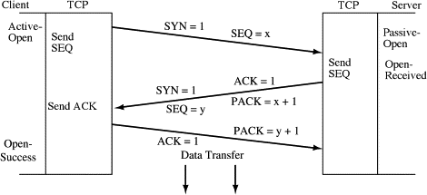
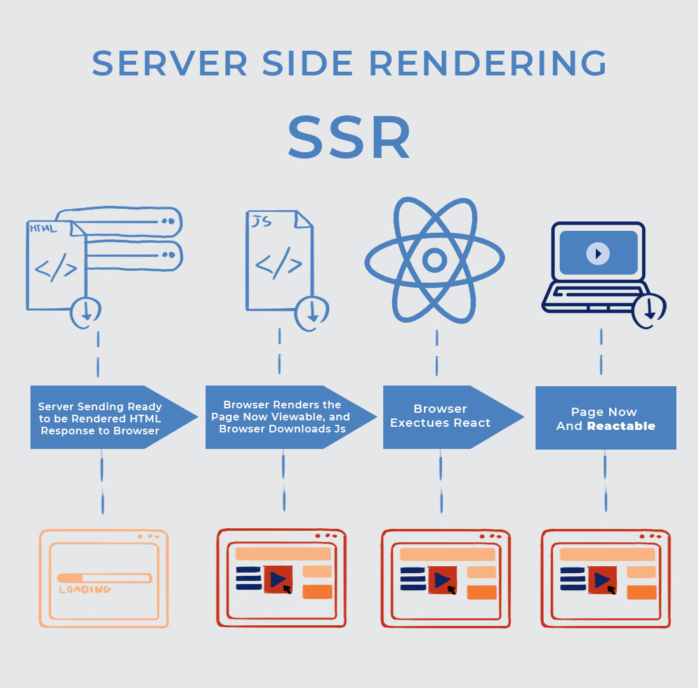
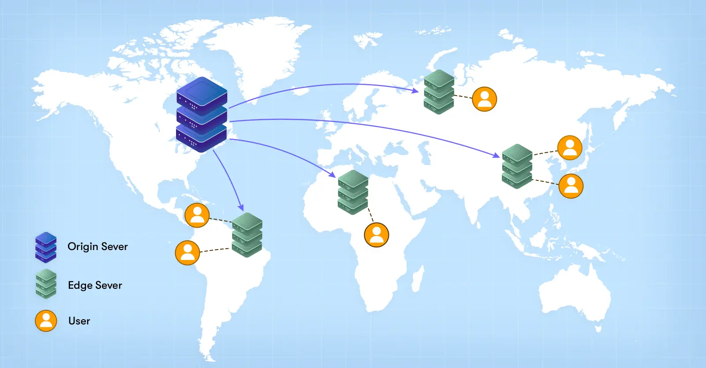

# What Happens When You Type "google.com" and Start Searching?

- When you type "google.com" into your browser’s address bar and hit enter, a series of complex processes are triggered behind the scenes, resulting in the webpage loading and you being able to start searching.
- The following happens :-
  
       1. Domain Name System (DNS) Lookup
       2. TCP/IP Connection
       3. SSL/TLS Handshake
       4. Sending the HTTP Request
       5. Server Response and Rendering the Page
       6. Search Query Execution
       7. Content Delivery and Interaction

## Domain Name System (DNS) Lookup
- Involves resolving the human-readable domain name "google.com" into an IP address, which is necessary for communication over the internet. Here’s how it happens:
    - **Cache Check**: The browser first checks its DNS cache for a recently resolved IP address for "google.com." If found, it uses this address, skipping further DNS lookup.
    - **OS Cache**: If the browser lacks the IP address, it queries the operating system's DNS cache.
    - **Router and ISP Cache**: If the OS cache also doesn’t have the information, the request moves to the router and then to the ISP, both of which may have cached DNS records.
    - **Recursive DNS Query**: If no cache contains the IP, the ISP’s DNS resolver initiates a recursive query. It starts at the root DNS servers, then proceeds to the Top-Level Domain (TLD) servers (e.g., for ".com"), and finally reaches Google’s authoritative DNS servers, which return the correct IP address for "google.com."
      


## TCP/IP Connection
- Once the IP address is resolved, the browser initiates a connection to Google’s servers using the Transmission Control Protocol (TCP) over the Internet Protocol (IP). This connection is established through a **three-way handshake**:
  - **SYN**: The browser sends a synchronization (SYN) packet to the server.

  - **SYN-ACK**: The server replies with a synchronization-acknowledgment (SYN-ACK).
    
  - **ACK**: The browser sends an acknowledgment (ACK), completing the handshake and establishing the TCP connection.



## SSL/TLS Handshake
- Given that Google uses HTTPS for secure communication, an SSL/TLS handshake occurs next:

    - **ClientHello**: Your browser sends a ClientHello message to the server, including details like supported SSL/TLS versions and cipher suites.

    - **ServerHello**: The server responds with a ServerHello message, selecting the SSL/TLS version and cipher suite.

    - **Certificate Exchange**: Google’s server sends its SSL/TLS certificate, which your browser validates to ensure the authenticity of the server.

   - **Session Keys**: Both the browser and the server generate session keys for encrypting the data that will be transmitted.
     


## Sending the HTTP Request
- Now that a secure connection is established, your browser sends an HTTP request to the Google server. The request typically looks like this and it tells the server that your browser wants to retrieve the main page of "google.com.":
 ```
  GET / HTTP/1.1
  Host: www.google.com
  User-Agent: Mozilla/5.0 (Windows NT 10.0; Win64; x64) AppleWebKit/537.36 (KHTML, like Gecko) Chrome/58.0.3029.110 Safari/537.3
  Accept: text/html,application/xhtml+xml,application/xml;q=0.9,image/webp,*/*;q=0.8
 ```
## Server Response and Rendering the Page
- **HTTP Response**: Google’s server processes the request and responds with an HTTP response, which includes the HTML, CSS, JavaScript, and other resources needed to render the page. For example:
```
HTTP/1.1 200 OK
Content-Type: text/html; charset=UTF-8
Content-Length: 12345
```
- **Rendering**: Your browser receives the response and starts parsing the HTML. It then fetches the CSS files, which determine the layout and styling, and executes JavaScript files that add interactivity. The browser’s rendering engine constructs the Document Object Model (DOM) tree and the CSS Object Model (CSSOM) tree, which together represent the page’s content and style.

- **Painting and Compositing**: Finally, the browser paints the content on the screen and composites layers (e.g., for overlapping elements) to render the complete webpage.



## Search Query Execution
- **AJAX Request**: When you submit the query, your browser sends an asynchronous JavaScript and XML (AJAX) request to Google’s search API endpoint. This request usually looks like:
```
POST /search?q=your+query HTTP/1.1
Host: www.google.com
```
- **Search Algorithm Execution**: Google’s server processes the query using its complex search algorithms, which involve indexing, ranking, and filtering billions of web pages to find the most relevant results.

- **Search Results Delivery**: The server then sends back a JSON response with the search results. Your browser dynamically updates the page with these results using JavaScript without requiring a full page reload.


## Content Delivery and Interaction
- As you interact with the search results, additional HTTP requests may be made (e.g., when loading images, videos, or more results). The entire process is optimized for speed and efficiency, ensuring that your experience is as seamless as possible.


